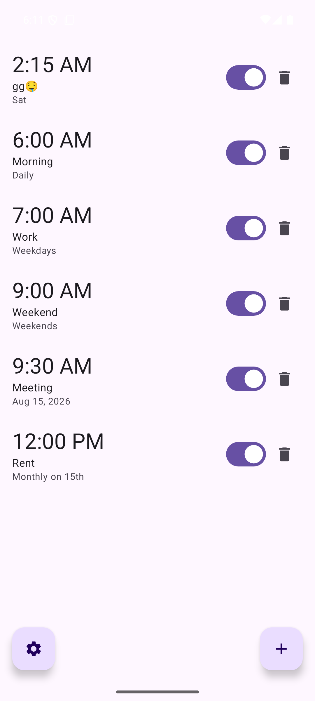
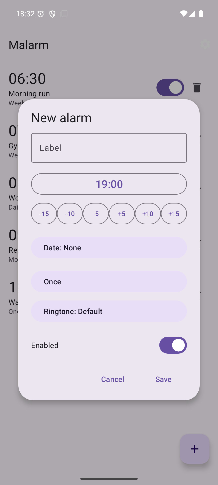
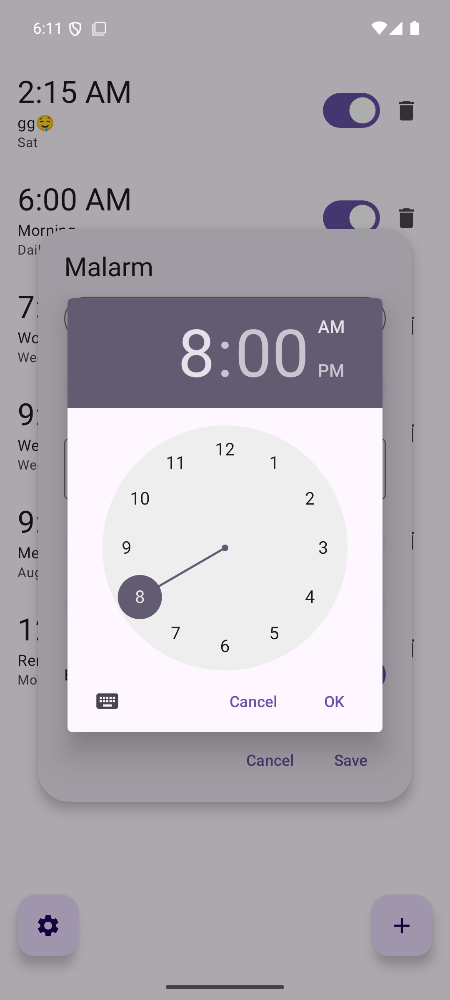
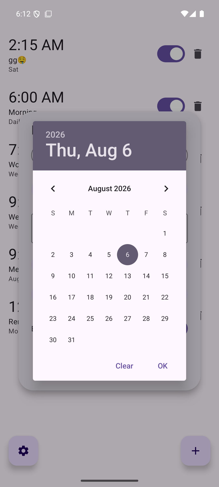
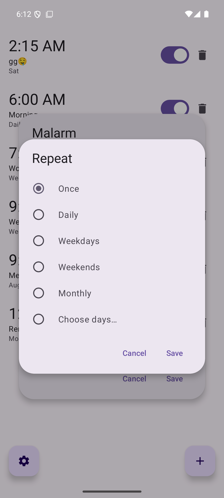
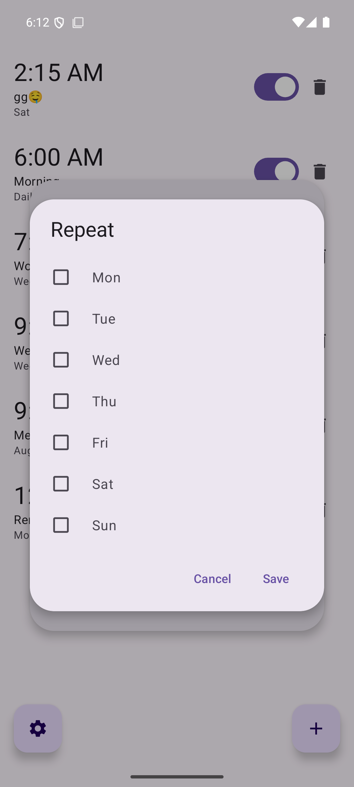

# Malarm

A minimal native-Kotlin Android alarm clock app (`com.malarm`).

- Add/edit/delete alarms with repeat presets (daily, weekdays, weekends, monthly, custom days)
- One-shot date alarms and snooze
- Exact-alarm scheduling with full-screen ringing and vibration
- Survives process death and reboots (BOOT_COMPLETED)

Build: `./gradlew assembleDebug`

## Screenshots

